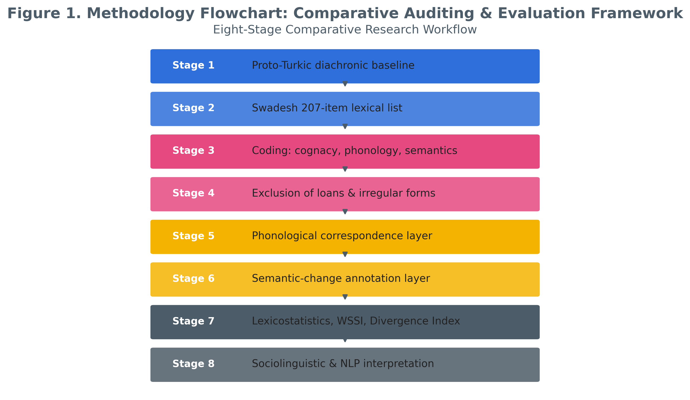
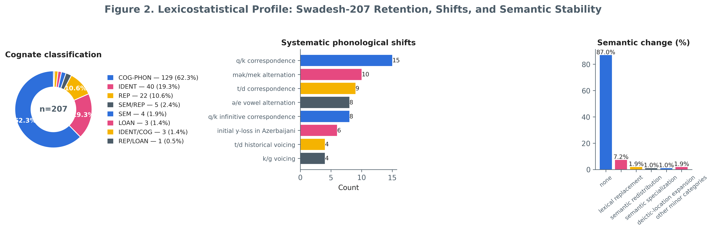
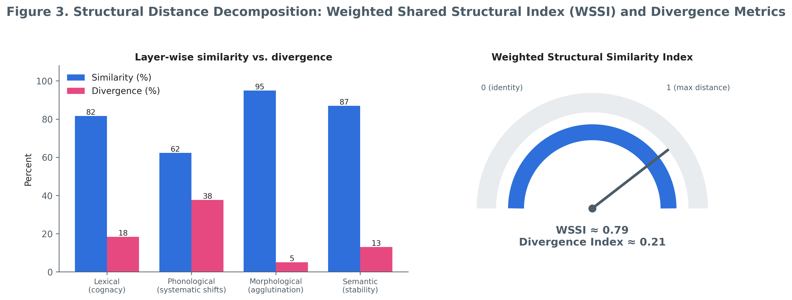
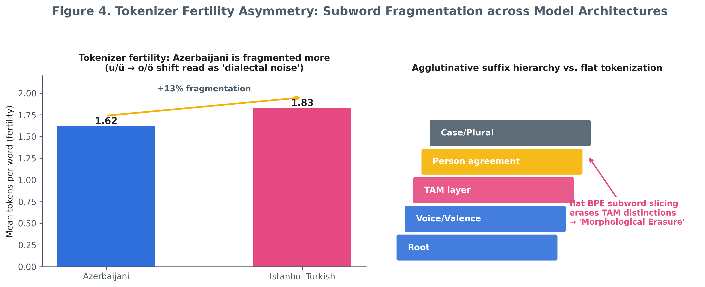
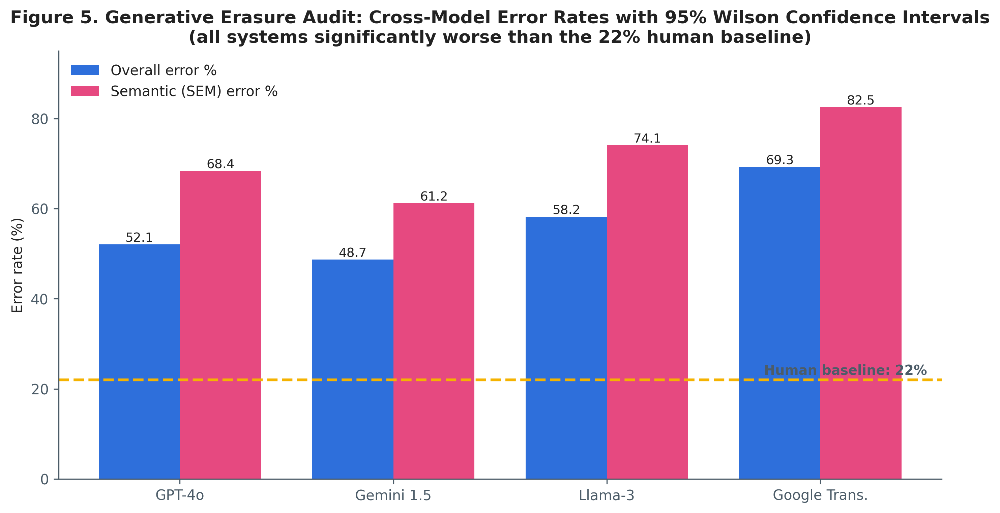

# Between Continuity and Divergence: Computational Asymmetry in Azerbaijani and Istanbul Turkish

[](LICENSE)
[](https://doi.org/10.5281/zenodo.22692791)


This repository contains the full computational research pipeline, visual artifacts, and supplementary data for the study **"Between Continuity and Divergence: Computational Asymmetry in Azerbaijani and Istanbul Turkish"**.

## 📊 Visual Overview
The research findings are synthesized in the following visual artifacts:

| Graphic Abstract | Methodology Flowchart |
| :---: | :---: |
|  |  |

| Lexicostatistics | Structural Distance | Tokenizer Fertility | Generative Erasure Audit |
| :---: | :---: | :---: | :---: |
|  |  |  |  |

## 📈 Numerical Results (LLM Evaluation)
The primary evaluation results are derived from `ODB_data_csvs/LLM_Evaluation_Results.csv`.

| Model | Overall Error Rate (%) | 95% Wilson Confidence Interval |
| :--- | :--- | :--- |
| **GPT-4o** | 52.1% | [45.2 – 59.0] |
| **Gemini 1.5 Pro** | 48.7% | [41.8 – 55.6] |
| **Llama-3-70B** | 58.2% | [51.3 – 65.1] |
| **Google Translate** | 69.3% | [62.4 – 76.2] |
##
🏁 Conclusion
Our analysis reveals a significant “asymmetry effect.” Despite high lexical continuity (82.1% cognate retention), Large Language Models consistently exhibit a “Turkish-centric” bias, leading to the generative erasure of unique Azerbaijani morphological markers. This study establishes a benchmark for evaluating linguistic fairness in low-resource Turkic language modeling.
##
@article{merrikhi2026odb,
  title={Between Continuity and Divergence: Computational Asymmetry in Azerbaijani and Istanbul Turkish},
  author={Merrikhi, Pegah},
  journal={Computational Linguistics & TESOL Studies},
  year={2026},
  doi={10.5281/zenodo.22692791},
  note={Available at: https://github.com/Pegi1727/ODB-Continuity-Divergence}
}
##

📝 Citation
If you utilize this data or code, please cite the work as follows:

## 📁 Repository Structure
```text
├── ODB_data_csvs/          # Primary raw data and Appendices A-F (CSV)
├── ODB_notebooks/          # Jupyter Notebooks for exploration (01-04)
├── ODB_python_scripts/     # Python analysis modules
├── ODB_R_scripts/          # R computational pipeline (Wilson CI, Stats)
├── figures/                # 300 DPI high-quality research figures
├── appendices/             # Full documentation (Docx & Markdown)
├── graphic abstract.png    # Project Graphic Abstract
└── README.md
